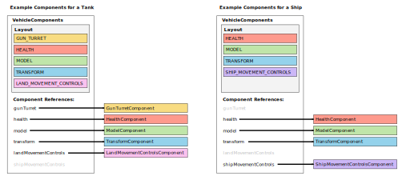
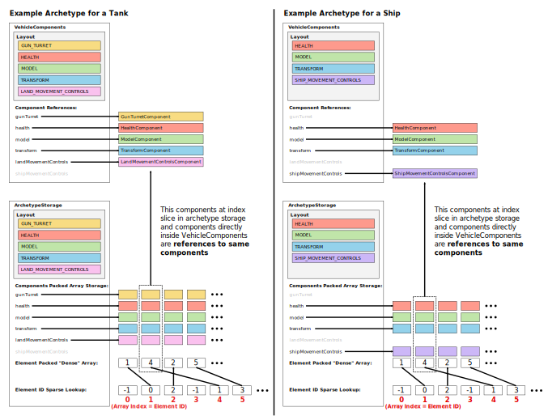

# XV Composable Vehicle Engine Architecture

*Edited: 2023-03-19*

At a high-level the vehicle engine architecture uses an archetype ECS [1-3].
The following are high-level design rules:
1. Vehicle "elements" are a set of vehicle "components", which are unique
   and an element can only have at most 1 component of each type.
2. Vehicle components are a pre-defined, **hard-coded** finite set (using an Enum)
3. Components cannot be added/removed after the element is created.
4. "Vehicles" are a tree hierarchy of vehicle elements.
5. Components, elements, and vehicles hold state but have no logic.
6. No cross-coupling allowed in a component. E.g. a component cannot
   know about other components, cannot query if it is part of a vehicle
   holding another component type, and should never hold any references
   to other components.
7. Components are stored in struct-of-arrays "archetypes" in a global
   storage.
8. Vehicle logic handled in systems which are pure functions that operate on
   and mutate components state.

This design doc includes simplified versions of components, elements, and 
vehicle data structures to illustrate the general engine architecture.


# Components layout


Components are a hard-coded set of types (simplified example below).
To simplify things, currently there is no support for letting a client
write custom components using this plugin as a library.

```kotlin
enum class VehicleComponentType {
    GUN_TURRET,
    HEALTH,
    MODEL,
    TRANSFORM,
    LAND_MOVEMENT_CONTROLS,
    SHIP_MOVEMENT_CONTROLS,
}

// component class implementations
data class GunTurretComponent( ... ) { ... }
data class HealthComponent( ... ) { ... }
data class ModelComponent( ... ) { ... }
data class TransformComponent( ... ) { ... }
data class LandMovementControlsComponent( ... ) { ... }
data class ShipMovementControlsComponent( ... ) { ... }
```

Each component is just a pure data class that holds component state
but contains no logic. Each component has a corresponding enum value.
The enum values let us specify a component **layout** as an `EnumSet`
indicating which components actually exist. We can then have a common
object that supports all components, using the layout to specify which
components actually exist inside:

```kotlin
data class VehicleComponents(
    // layout specifies which components exists
    val layout: EnumSet<VehicleComponentType>,

    // all components supported, but they may or may not exist
    // inside this components object 
    val gunTurret: GunTurretComponent? = null,
    val health: HealthComponent? = null,
    val model: ModelComponent? = null,
    val transform: TransformComponent? = null,
    val landMovementControls: LandMovementControlsComponent? = null,
    val shipMovementControls: ShipMovementControlsComponent? = null,
)
```
The `VehicleComponents` is the basic storage unit of components for a vehicle.
This structure comes with tradeoffs/limitations:
1. **Only allows engine hard-coded component types.** If we allow unknown,
   customizable component types, we can no longer hard code fields for
   each component. A possible extension is to add some field for custom
   components using a `Map<Int, UnknownComponent>`, but this will complicate
   specifying component layouts. We would need to migrate from enum system
   perhaps into a bitset style system with id ranges allocated for built-in
   components and for custom components.
2. **Can't have that many unique component types.** If we had to support 
   1000s of different component types, then the memory footprint would
   become very painful. But we are well <100 component types, so this
   structure is still pretty small (just a bunch of references).

The **layout** is also referred to as the **archetype** of the vehicle,
which is common ECS terminology [1-3].


# VehicleElement and Vehicle Layout


```kotlin
class VehicleElement(
    // identifier tags:
    // readable name identifier
    val name: String,
    // persistent id saved across server restarts
    val uuid: UUID,
    // transient id, used to index into runtime elements storage
    val id: ElementId,

    // components in element 
    val components: VehicleComponents,
) {
    // parent and children hierarchy set lazily after creation
    var parent: VehicleElement? = null
    var children: List<VehicleElement> = listOf()
}
```
The core of a **vehicle element** is just an instance of components along
with some identifier tags. Reason for each tag:
- `name`: Used as a human readable name for debugging.
- `uuid`: Unique, persistent id for the element that is saved/loaded.
- `id`: This is an integer id used for faster indexing in storage
  data structures (rather than using the uuid). This id is assigned
  when element is inserted into storage, and it can change on every
  server restart.

Next questions:
- **How do we add multiple components directly to vehicle?**
  E.g. can we have two gun turrets? Allowing multiple components
  significantly complicates the simple layout and component references
  structure...
- **Can we position some vehicle elements relative to other parts?**
  Can we have a gun turret attached to a model? How about a gun turret attached
  to a model that is itself attached to another model?


```kotlin
class Vehicle(
    // identifier tags:
    // readable name identifier
    val name: String,
    // persistent id saved across server restarts
    val uuid: UUID,
    // transient id, used to index into runtime elements storage
    val id: ElementId,

    // elements in vehicle, ordered from tree depth sorted elements
    val elements: List<VehicleElement>,
)
```

A **vehicle** is a tree of multiple vehicle elements. This solves allowing
multiple components and how to position elements relative to other elements.
Vehicle is created from a set of vehicle elements and a description of the
element tree hierarchy.

During vehicle creation, the elements are depth sorted. This makes
it easier if we need to update elements in sorted parent-child order.

In the element config, we give each element a string "name". We can
then specify an element's parent inside the config using the string names.
The parent/child tree hierarchy are formed by element's `parent` and
`children` fields, which are set after elements are all created.
We can then traverse the element trees and form a depth-sorted elements
list for the vehicle.


# Components Storage


```kotlin
class ArchetypeStorage(
    // component layout, indicates which storages exist
    layout: EnumSet<VehicleComponentType>,
    // max number elements allowed in storage
    maxElements: Int,
) {
    // sparse lookup from element id => element components dense index
    // (note vehicle element id is just a typealias for int)
    val lookup: IntArray

    // reverse lookup from dense array index => vehicle element id
    val elements: IntArray

    // dense packed components storage arrays
    // only components in layout will be non-null arrays
    val gunTurret: ArrayList<GunTurretComponent>?
    val health: ArrayList<HealthComponent>?
    val model: ArrayList<ModelComponent>?
    val transform: ArrayList<TransformComponent>?
    val landMovementControls: ArrayList<LandMovementControlsComponent>?
    val shipMovementControls: ArrayList<ShipMovementControlsComponent>?
}
```

```kotlin
class ComponentsStorage(
    val maxElements: Int,
) {
    // layout enum set => archetype storage
    val lookup: HashMap<EnumSet<VehicleComponentType>, ArchetypeStorage>

    // global element ids
    // fixed-size lookup table mapping element id  => element
    val elementsLookup: Array<VehicleElement?>

    // free element ids stack:
    // - pop to allocate an id
    // - push free id back when element deleted
    val freeElementIds: Stack<ElementId>

    // element uuid -> element
    val uuidToElement: HashMap<UUID, VehicleElement>
}
```

Assumptions:
- No adding/removing components during runtime. Once vehicle element is
made, it is fixed.
- Vehicle elements define component layouts. All possible layouts can be
generated at startup and pre-determined after parsing configs.
- Have constant max number of elements, `MAX_VEHICLE_ELEMENTS` defined in
config. Mineman server performance won't handle more than a few thousand
vehicles so there is no reason to support an infinite number. Constrain 
the max count, then simply stop new vehicles from being created when limit
reached.

With these requirements, the Archetype ECS data storage pattern [1-3] is
best suited because we dont need to add/remove components and mainly need
fast query + iteration performance. Since we know all layouts based on
parsing config files, we can create all archetype storages needed during
load.

## `ArchetypeStorage`: Stores Component Sets for Iteration
Internally the components archetype storage is backed by a "sparse set" 
data structure, read [4] for background knowledge needed. The sparse set
combines a sparse indexed lookup (using element id) for `O(1)` lookup and
a packed "dense" storage array for `O(n)` iteration.

Vehicle element `id` field indexes into the sparse lookup table. The integer
value stored inside the lookup array at index `id` corresponds to the
index in the dense packed array, which contains the element's components.

For example of archetype lookup as shown in the images above:
- Vehicle element id = 4
- `archetype.lookup[4]` == 1: Use element id directly as index in lookup.
  The value in lookup array is the dense index, in this case index 1.
- `archetype.health[1]` == Vehicle's `HealthComponent`: We use the dense
  index = 1 (found by lookup), to index into the archetype's `health`
  components array. The value at dense index 1 is the same vehicle
  `HealthComponent` as the component stored by `VehicleComponents`.  
- `archetype.model[1]` == Vehicle's `ModelComponent`
- and so on...

## `ComponentsStorage`: Manages Archetype Storages and Element Ids
The `ArchetypeStorage` is the internal building block for the global
components storage. The `ComponentsStorage` manages all archetypes. At
its core is just a map from layouts `EnumSet<VehicleComponentType>` to
their `ArchetypeStorage`.

The secondary purpose of `ComponentsStorage` is the global element id
allocation manager:
- `freeElementIds`: Maintains a stack of available element ids.
- `elementsLookup`: Element "id" corresponds to array index, allowing fast
  element lookup from id. This array is a similar sparse lookup array as in
  the `ArchetypeStorage`, and can contain holes when elements are deleted.
- `uuidToElement`: Alternative lookup using element UUID. This is only used
  in cases where a UUID is stored in a Minecraft object like an entity or
  item and we need to check if element exists with that UUID.


## Note on Archetype Storage Format.

The storages use struct of arrays, if you are not familiar see [6].
If archetype is for type `(A, B, C, D)` and we only want to read `(A, B)`
in a system, theres two reasonable layout types [6]:
```
StructOfArray {
    a: Array<A>,
    b: Array<B>,
    c: Array<C>,
    d: Array<D>,
}
```
versus
```
ArrayOfStruct {
    data: Array<(A, B, C, D)>
}
```
But the fist one struct of arrays (SoA) is much easier for querying
component subsets for Iterators.

    
## Note on Archetype Auto-Generation

Because we are hard-coding vehicle components, there is a lot of boilerplate
for adding a component. To deal with this, archetype storage is auto
generated with python scripts and templates in the `scripts/` folder.
The files there are
- `archetype_gen.py`: Run this to generate archetypes. Should be run
  each time a component type is added/removed.
- `components.py`: Specify all component classes and their enum type
  in here.
- `documentation_gen.py`: Generates component config documentation
  examples. 


# Elements and Vehicles Storage


# Vehicle Creation and Deletion Life Cycle

## Prototypes

## Vehicle Build Sequence

## Standardized Component Life Cycle Interface: `VehicleComponent`
So that all components satisfy this creation/deletion process, all components
must implement the `VehicleComponent` interface. This contains overrideable
creation functions to allow customizing creation/deletion for components,
as well as an important `deepclone()` function.

## `deepclone()` to Prevent Accidental Shared Objects
Components must manually implement `deepclone()` if they internally
contain non-primitive, object references as state. A real case was components
holding `Array<T>` or `IntArray` objects. Without a `deepclone()`, the
components injected into the global state will all be sharing references
to the same `Array<T>`, so mutating the array affected all components.
This is fixed by making `deepclone()` deep clone the array object.


# Data Config

Vehicles, elements, and components are designed as such to be highly
composable by user configs. The same components can be re-used to
create different vehicle types. `.toml` config format is the default
engine standard:
- TOML format spec: https://toml.io/en/v1.0.0
- Particularly, read array of tables: https://toml.io/en/v1.0.0#array-of-tables

Below are examples of `.toml` data config format for vehicles:

## Example: Simple tank
```toml
# Simple vehicles do not have any duplicate components so
# these only need a single element. In this case, we can
# just write components directly in the config.
# Parser will do a scan and recognize this only needs a
# single anonymous element.

name = "tank"

# contains position, rotation, etc.
[transform]

# handles player's input controls for land movement
[land_movement]
acceleration = 0.25
max_speed = 1.5

# tank turret movement and input controls
[tank_turret]
offset = [0, 1, 0]
```

## Example: Complicated ship with multiple turrets
```toml
# A vehicle that needs multiple of the same components
# needs to explicity define the elements, give them names
# and setup parenting.

name = "gunboat"

### MAIN BOAT ELEMENT
[[element]]
name = "base"

# main boat position, rotation, etc.
[element.transform]

# handles player's input controls for land movement
[element.water_movement]
acceleration = 0.25
max_speed = 1.5


### LEFT SIDE GUN TURRET
[[element]]
name = "left_turret"
parent = "base"

[element.transform]
offset = [-1, 1, 0]

[element.artillery_turret]


### RIGHT SIDE GUN TURRET
[[element]]
name = "right_turret"
parent = "base"

[element.transform]
offset = [1, 1, 0]

[element.artillery_turret]
```


# Engine / Global Data Storage Layout

Engine is global data storage and manages all vehicle update logic:

```rust
Engine {
    /// HARD-CODED PROPERTIES
    
    /// Global map of all vehicles
    vehicles: HashMap<VehicleId, Vehicle>,

    /// Associate mineman entity uuid => Vehicle
    entity_to_vehicle: HashMap<UUID, Vehicle>,

    /// ENTITY/COMPONENT STORAGE
    /// Component support must support:
    /// - iteration over groups of components associated with the same id:
    ///     - components.iter((C1, C2, C3)) => iter over (id, comp1, comp2, comp3)
    /// - individual entity queries:
    ///     - components.get(id).position.get()
    components: ComponentsStorage,

    /// Hard-coded system schedule to update all vehicle components.
    /// Mineman single-threaded, so just pass each system the entire
    /// components storage. Systems are arbitrary functions that
    /// implicitly follow interface `system_fn(components, ...)`
    /// where `components` is the first arg, ... is arbitrary other
    /// args. Interface not strictly enforced because some systems
    /// need other global resources (e.g. timestamp, or update dt)
    fn update() {
        system_land_movement(components)
        system_water_movement(components)
        system_artillery_turrets(components)
        system_tank_turrets(components)
    }
}
```


# ECS System Programming

See Refs [1-5] for ECS architecture design and its problems.  

This contains some examples of ECS style programming for things 
that are easy in typical hierarchical OOP, but more difficult in ECS.

## Note: Differences from a "Pure" ECS

In a "pure ECS", the `Engine` world state would only be the `components`
storage. No other properties like `vehicles` or `entity_to_vehicle`.
Those would normally be stored as their own type of "singleton" components.
Because we are designing a very specific engine, we can ignore these
rules and just hard-code our specific "singleton" components, and pass
them directly into system functions as needed.


## Example: Basic Systems

People usually shill ECS with simple iteration example like below.
These are where ECS works well, but is fairly trivial and doesn't 
show problems with ECS.
```rust
fn system_land_movement(components: ComponentsStorage) {
    for transform, land_controller in components.query<TransformComponent, LandMovementComponent>() {
        let new_transform = {
            // update with current transform and land controller state.
            ...
        };
        transform.position = new_transform.position;
        transform.rotation = new_transform.rotation;
    }
}
```


## Example: Vehicle Creation / Spawning

Entity creation relies on doing external modification on the data storage.
Since we don't have a pure ECS, we can just create data structures outside
of the main component storage to handle these external event signals.

Because mineman and this engine is single-threaded, we don't need to
worry about synchronization issues required in a real ECS.
Entity creation/deletion and component add/remove is a pain point in ECS.
In parallel ECS this always requires a sync step and a system that
can take control of the entire ECS, e.g. see Legion's
https://docs.rs/legion/latest/legion/systems/struct.CommandBuffer.html

```rust
/// Engine global variable that holds a queue of all player 
/// vehicle creation requests.
const requests: ArrayList<CreateRequest>

@EventHandler
fn event_player_uses_item(event: PlayerItemEvent) {
    requests.add(CreateRequest(event))
}

/// System that takes components and the external event queue.
fn system_vehicle_creation(components: ComponentsStorage, requests: ArrayList<CreateRequest>) {
    for req in requests {
        // create entity:
        // 1. process item in player hand, check if valid, etc.
        // 2. convert it into an vehicle layout
        // 3. initialize components here from item, then insert
        //    elements and components into storage.
    }
}
```


## Example: Parent, Child / Multiple Components

Trees/hierarchies are difficult to implement in ECS data layouts, since
these require some form of pointer link between objects. This is another
situation since we only care about vehicles, we break away from a pure ECS
more and hard-code vehicle element hierarchy structure. In a "pure ECS" this
would be another component, but because this is so core to vehicles, we
can just hard code it.

There's no "good" way to do this in an ECS, this is a pain point that we
will adjust as we try things out.

```rust
VehicleElement {
    /// Main layout from before
    name: String,
    id: ElementId,
    components: EnumSet<VehicleComponentType>,

    /// Additional built-in parent-child tree structure
    parent: ElementId,
    children: Array<ElementId>,
}

/// Engine global variable stores list of all vehicle tree roots.
/// These are vehicle elements with no parent and have children.
const root_elements_with_children: Set<ElementId>

fn system_vehicle_creation(components: ComponentsStorage, requests: ArrayList<CreateRequest>) {
    for req in requests {
        // do previous steps...

        // ADDITIONAL:
        for element in elements_created {
            // add parent, child relationships
            // determine these by node string names in config
            if has_no_parent_and_has_children(element) {
                root_elements_with_children.add(element)
            }
        }
    }
}


/// In engine update, we call this system with the `root_elements_with_children`
fn system_update_positions(components: ComponentsStorage, root_elements: Set<ElementId>) {
    // do tree update
    for element in root_elements {
        if element.components.has(TRANSFORM_COMPONENT) {
            // update()
            for child in element.children {
                // update()
            }
        }
    }
}
```


## Example: External Events, Handling User Controls

Events are designed for typical OOP or actor programming models, 
`event => object.handle(event)`. In ECS style, you never call
method directly on object. This is same as vehicle creation, use a
global queue then pass it to the system.

This is another issue with ECS: shared resources between components,
e.g. user inputs. There's no need for each vehicle to have a separate
component that holds player movement controls. But ECS architectures
don't easily support sharing common resources. Here we just do it by
manually hard-coding and passing around shared global resources.

```rust
/// Engine global variable that holds player controls
const controls: HashMap<UUID, PlayerControls>

@EventHandler
fn event_player_controls(event: PlayerControlsEvent) {
    controls[event.player.id] = PlayerControls(event)
}

/// System that takes components and global controls,
/// Re-write the land movement controls from first example...
fn system_land_movement(
    components: ComponentsStorage,
    controls: HashMap<UUID, PlayerControls>,
) {
    for transform, land_controller in components.query<TransformComponent, LandMovementComponent>() {
        let new_transform = {
            // update with player controls, current transform and land controller state.
            if land_controller.passenger != null {
                let player_controls = controls[land_controller.passenger.id]
                // update...
            }
            // ...
        };
        transform.position = new_transform.position;
        transform.rotation = new_transform.rotation;
    }
}
```


## Example: External Events, Handling Damage, Vehicle Deletion

Just another example of queueing events. We'll have another input
queue for projectile damage events, then have a queue of entities
to delete if their health goes less than 0.

```rust
/// Engine global variable that queue of projectile damage
const projectile_damage_queue: Array<ProjectileDamageRequest>

/// Vehicles that are "dead" and need to be deleted
const dead_vehicles: Array<DeleteVehicleRequest>

@EventHandler
fn event_projectile_damage(event: ProjectileDamageEvent) {
    projectile_damage_queue.add(ProjectileDamageRequest(event))
}

/// System that handles all damage "requests" and creates output
/// "requests" for a vehicle that is destroyed.
/// 
/// "Requests" are an equivalent idea as "events" here, our queue
/// processes input events and emits new output events.
fn system_damage(
    components: ComponentsStorage,
    projectile_damage_queue: Array<ProjectileDamageRequest>,
    dead_vehicles: Array<DeleteVehicleRequest>,
) {
    // handle damage requests
    for request in projectile_damage_queue {
        // components maps from mineman entity to vehicle element
        let element_id = components.get(request.entity)
        // get health component from element
        let health = components.get<HealthComponent>(element_id)
        
        // do damage here...

        // if vehicle dead, push a delete request into delete queue
        if health <= 0 {
            dead_vehicles.add(DeleteVehicleRequest(element_id))
        }
    }
}

/// This system runs after damage and any other systems that mark vehicles to
/// be deleted.
fn system_delete_vehicles(
    components: ComponentsStorage,
    dead_vehicles: Array<DeleteVehicleRequest>,
) {
    for request in dead_vehicles {
        // delete vehicle logic
    }
}
```


# Limitations and Future Architectural Changes

Future extensions needed (should implement both together):
1. Support runtime loading custom components
2. Systems scheduler, cull unused systems

## 1. Supporting custom loaded components
The most limiting aspect of this implementation is hard-coding component 
types. This makes this unusable a library. In the ideal case, a user would
use this as the core vehicle engine and use base components, then implement
and compile custom components using this a as a library, into an extension
`.jar`. Then this plugin should runtime load these custom component
definitions, before parsing the vehicle `.toml` configs. 

The reason for hard-coding components was simplicity and some slight
performance. If we allow custom components, we will need to introduce
another layer of indirection in the archetype storages (higher complexity,
plus another layer indirection). We also cannot use simple enums or
hardcode components into a `VehicleComponents` type anymore, without
introducing some kind of map `Map<Class, UnknownComponent>`


## 2. Systems scheduler
As more very-specific components are written, its likely that servers
will not need all components/systems and only need a small subset. E.g. a 
server set in ancient times will want ships but likely not planes.

In future convert systems into something like a `Runnable` interface,
and replace the current hard-coded update tick with a scheduled 
runtime generated list of runnables that only run systems that involve
components actually used.

This can be done by:
1. We assume no adding/removing components, so prototypes parsed at load
   will specify all possible components used.
2. Make systems a class that must specify all components queried.
3. Check system's component dependencies with the loaded list of all
   possible components from 1. If a system involves a component that
   no prototype uses, then we can cull the system.
4. The **scheduler** will perform 3 and build a final update function
   with only a list of systems that actually need to run.

The new system class can also implement some optimizations like caching
references to all archetype storages (or even the storage arrays themselves)
that need to be accessed. This could potentially reduce some of the 
indirection costs for allowing custom component types.

This scheduler should also parallelize systems if possible. Though only a
few systems are safe to parallelize, as most of the Bukkit API needs to
be synchronous.


# References
[1] ECS data layouts: https://csherratt.github.io/blog/posts/specs-and-legion/

[2] Legion, archetype based ECS: https://github.com/amethyst/legion

[3] Unity ECS concepts: https://docs.unity3d.com/Packages/com.unity.entities@0.2/manual/ecs_core.html

[4] skypjack's ECS series: https://skypjack.github.io/2019-02-14-ecs-baf-part-1/

[5] ECS problems: https://ajmmertens.medium.com/why-vanilla-ecs-is-not-enough-d7ed4e3bebe5

[6] Array of structs vs struct of arrays: https://en.wikipedia.org/wiki/AoS_and_SoA

[7] cache friendly data structures/benchmarks: https://tylerayoung.com/2019/01/29/benchmarks-of-cache-friendly-data-structures-in-c/

[8] high perf computing, hardware/cache meme: https://en.algorithmica.org/hpc/  