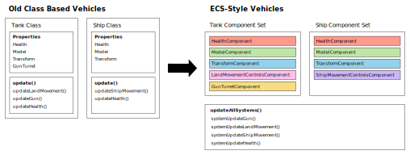
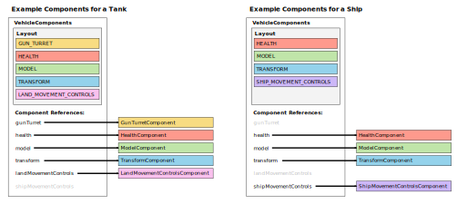
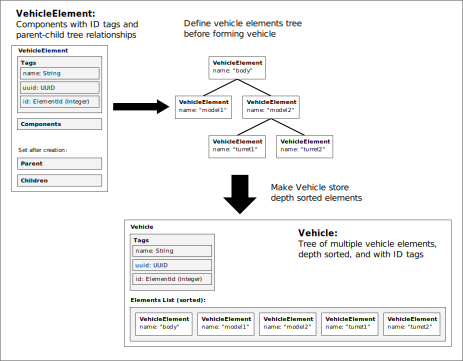
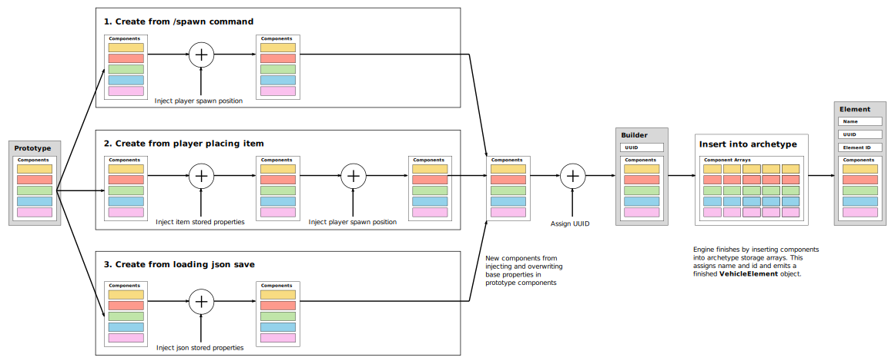
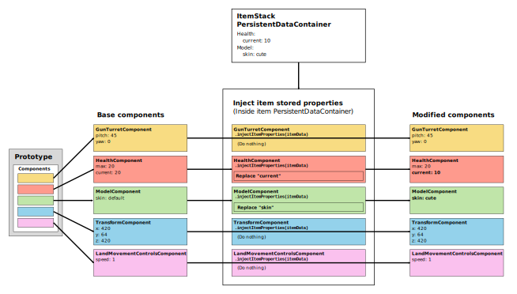
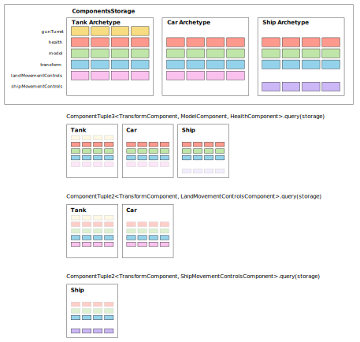
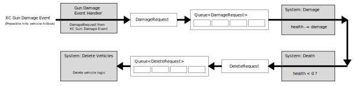

# XV Composable Vehicle Engine Architecture

*Edited: 2023-03-25*

At a high-level the vehicle engine uses an archetype based
entity-component-system (ECS) architecture [1-3].
The following are high-level design rules:
1. Vehicle "elements" are a set of vehicle "components", which are unique
   and an element can only have at most 1 component of each type.
2. Vehicle components are a pre-defined, **hard-coded** finite set (using an Enum)
3. Components cannot be added/removed after the element is created.
4. "Vehicles" are a tree hierarchy of vehicle elements.
5. Components, elements, and vehicles hold state but have no logic.
6. No cross-coupling allowed in a component. E.g. a component cannot
   know about other components, cannot query if it is part of a vehicle
   holding another component type, and should never hold any references
   to other components.
7. Components are stored in struct-of-arrays "archetypes" in a global
   storage.
8. Vehicle logic handled in systems which are pure functions that operate on
   and mutate components state.

This design doc includes simplified versions of components, elements, and 
vehicle data structures to illustrate the general engine architecture.


# Why ECS?


In an old vehicles system, we had a "Tank class" and a "Ship class" that
had their specific properties and update function. Both would implement a
standard `Vehicle` interface, and a global update loop would run
`tank.update()` and `ship.update()`.

In this ECS architecture, there are no "Tank class" or "Ship class".
Instead, we decomposed these vehicles as a group of "components" that
represent the vehicle's functionality. A tank has health, land movement, a 
model, and a gun turret. The ship also has health and a model, but
has no gun turret and instead has ship movement.

Instead of `tank.update()` and `ship.update()` we think of each aspect of
a vehicle as a "system". Updating health is a "system". Updating movement
is a "system". So instead we update entire systems, which will update all
vehicle that uses that property. E.g. `systemHealth.update()`,
`systemLandMovement.update()` and `systemShipMovement.update()`.

ECS is an organizational pattern that makes it easier to share properties
across vehicles, which then allows us to easily configure new vehicles
by re-using the same systems. Benefits:
- **Easier to compose new vehicles from components**:
  This is the main benefit. By writing "components" instead of vehicles,
  we can build vehicles by just mix-matching components inside config file. 
- **Better re-usability of components**:
  Continuing above point, we only need to write components and systems once,
  then we can re-use them for every vehicle. Tanks, cars, chariots can all
  re-use the same land movement controls. And almost all vehicles re-use
  the same health, hitbox, seats, and mounting systems.
- **Better code organization**: 
  Can enforce clear code organization: (1) components are pure data config +
  state, (2) systems functions implement actual controls, behavior, etc.

Reasons NOT to use ECS:
- **Performance is worse**:
  By generalizing classes `Tank` and `Ship` into components, we are adding
  overhead and indirection to access components. And since we split single
  `tank.update()` and `ship.update()` into separate system `update()` calls,
  we add overhead in update. Outside of Mineman, ECS can generally be net
  better for performance because ECS systems updates can be easier to
  parallelize. But because our most compute intense systems
  (like land/ship/air movement) require single-threaded Bukkit API, we lose
  parallelization benefits of ECS. So as whole, performance of this ECS
  should be worse than class specific vehicles using `tank.update()` and
  `ship.update()`.
- **Integration with Mineman is hard**:
  Mineman Bukkit API is event driven, feeding those events into the ECS
  system is annoying and adds complexity.


# Components layout


Components are a hard-coded set of types (simplified example below).
To simplify things, currently there is no support for letting a client
write custom components using this plugin as a library.

```kotlin
enum class VehicleComponentType {
    GUN_TURRET,
    HEALTH,
    MODEL,
    TRANSFORM,
    LAND_MOVEMENT_CONTROLS,
    SHIP_MOVEMENT_CONTROLS,
}

// component class implementations
data class GunTurretComponent( ... ) { ... }
data class HealthComponent( ... ) { ... }
data class ModelComponent( ... ) { ... }
data class TransformComponent( ... ) { ... }
data class LandMovementControlsComponent( ... ) { ... }
data class ShipMovementControlsComponent( ... ) { ... }
```

Each component is just a pure data class that holds component state
but contains no logic. Each component has a corresponding enum value.
The enum values let us specify a component **layout** as an `EnumSet`
indicating which components actually exist. We can then have a common
object that supports all components, using the layout to specify which
components actually exist inside:

```kotlin
data class VehicleComponents(
    // layout specifies which components exists
    val layout: EnumSet<VehicleComponentType>,

    // all components supported, but they may or may not exist
    // inside this components object 
    val gunTurret: GunTurretComponent? = null,
    val health: HealthComponent? = null,
    val model: ModelComponent? = null,
    val transform: TransformComponent? = null,
    val landMovementControls: LandMovementControlsComponent? = null,
    val shipMovementControls: ShipMovementControlsComponent? = null,
)
```
The `VehicleComponents` is the basic storage unit of components for a vehicle.
This structure comes with tradeoffs/limitations:
1. **Only allows engine hard-coded component types.** If we allow unknown,
   customizable component types, we can no longer hard code fields for
   each component. A possible extension is to add some field for custom
   components using a `Map<Int, UnknownComponent>`, but this will complicate
   specifying component layouts. We would need to migrate from enum system
   perhaps into a bitset style system with id ranges allocated for built-in
   components and for custom components.
2. **Can't have that many unique component types.** If we had to support 
   1000s of different component types, then the memory footprint would
   become very painful. But we are well <100 component types, so this
   structure is still pretty small (just a bunch of references).

The **layout** is also referred to as the **archetype** of the vehicle,
which is common ECS terminology [1-3].


# VehicleElement and Vehicle Layout


```kotlin
class VehicleElement(
    // identifier tags:
    // readable name identifier
    val name: String,
    // persistent id saved across server restarts
    val uuid: UUID,
    // transient id, used to index into runtime elements storage
    val id: ElementId,

    // components in element 
    val components: VehicleComponents,
) {
    // parent and children hierarchy set lazily after creation
    var parent: VehicleElement? = null
    var children: List<VehicleElement> = listOf()
}
```
The core of a **vehicle element** is just an instance of components along
with some identifier tags. Reason for each tag:
- `name`: Used as a human readable name for debugging.
- `uuid`: Unique, persistent id for the element that is saved/loaded.
- `id`: This is an integer id used for faster indexing in storage
  data structures (rather than using the uuid). This id is assigned
  when element is inserted into storage, and it can change on every
  server restart.

Next questions:
- **How do we add multiple components directly to vehicle?**
  E.g. can we have two gun turrets? Allowing multiple components
  significantly complicates the simple layout and component references
  structure...
- **Can we position some vehicle elements relative to other parts?**
  Can we have a gun turret attached to a model? How about a gun turret attached
  to a model that is itself attached to another model?


```kotlin
class Vehicle(
    // identifier tags:
    // readable name identifier
    val name: String,
    // persistent id saved across server restarts
    val uuid: UUID,
    // transient id, used to index into runtime elements storage
    val id: ElementId,

    // elements in vehicle, ordered from tree depth sorted elements
    val elements: List<VehicleElement>,
)
```

A **vehicle** is a tree of multiple vehicle elements. This solves allowing
multiple components and how to position elements relative to other elements.
Vehicle is created from a set of vehicle elements and a description of the
element tree hierarchy.

During vehicle creation, the elements are depth sorted. This makes
it easier if we need to update elements in sorted parent-child order.

In the element config, we give each element a string "name". We can
then specify an element's parent inside the config using the string names.
The parent/child tree hierarchy are formed by element's `parent` and
`children` fields, which are set after elements are all created.
We can then traverse the element trees and form a depth-sorted elements
list for the vehicle.


# Components Storage


```kotlin
class ArchetypeStorage(
    // component layout, indicates which storages exist
    layout: EnumSet<VehicleComponentType>,
    // max number elements allowed in storage
    maxElements: Int,
) {
    // sparse lookup from element id => element components dense index
    // (note vehicle element id is just a typealias for int)
    val lookup: IntArray

    // reverse lookup from dense array index => vehicle element id
    val elements: IntArray

    // dense packed components storage arrays
    // only components in layout will be non-null arrays
    val gunTurret: ArrayList<GunTurretComponent>?
    val health: ArrayList<HealthComponent>?
    val model: ArrayList<ModelComponent>?
    val transform: ArrayList<TransformComponent>?
    val landMovementControls: ArrayList<LandMovementControlsComponent>?
    val shipMovementControls: ArrayList<ShipMovementControlsComponent>?
}
```

```kotlin
class ComponentsStorage(
    val maxElements: Int,
) {
    // layout enum set => archetype storage
    val lookup: HashMap<EnumSet<VehicleComponentType>, ArchetypeStorage>

    // global element ids
    // fixed-size lookup table mapping element id  => element
    val elementsLookup: Array<VehicleElement?>

    // free element ids stack:
    // - pop to allocate an id
    // - push free id back when element deleted
    val freeElementIds: Stack<ElementId>

    // element uuid -> element
    val uuidToElement: HashMap<UUID, VehicleElement>
}
```

Assumptions:
- No adding/removing components during runtime. Once vehicle element is
made, it is fixed.
- Vehicle elements define component layouts. All possible layouts can be
generated at startup and pre-determined after parsing configs.
- Have constant max number of elements, `MAX_VEHICLE_ELEMENTS` defined in
config. Mineman server performance won't handle more than a few thousand
vehicles so there is no reason to support an infinite number. Constrain 
the max count, then simply stop new vehicles from being created when limit
reached.

With these requirements, the Archetype ECS data storage pattern [1-3] is
best suited because we dont need to add/remove components and mainly need
fast query + iteration performance. Since we know all layouts based on
parsing config files, we can create all archetype storages needed during
load.


## `ArchetypeStorage`: Stores Component Sets for Iteration
Internally the components archetype storage is backed by a "sparse set" 
data structure, read [4] for background knowledge needed. The sparse set
combines a sparse indexed lookup (using element id) for `O(1)` lookup and
a packed "dense" storage array for `O(n)` iteration.

Benefits of this structure:
- `O(n)` iteration over a set of components across all archetypes,
  e.g. `components.iter<A, B, C>()` => yields
  `(id, comp1, comp2, comp3)`, where `A`, `B`, and `C` are different
  component types, for all elements containing this set.
- `O(1)` map access for getting element components by `id`, 
  `components.get(id)` => element and its components.

Vehicle element `id` field indexes into the sparse lookup table. The integer
value stored inside the lookup array at index `id` corresponds to the
index in the dense packed array, which contains the element's components.

For example of archetype lookup as shown in the images above:
- Vehicle element id = 4
- `archetype.lookup[4]` == 1: Use element id directly as index in lookup.
  The value in lookup array is the dense index, in this case index 1.
- `archetype.health[1]` == Vehicle's `HealthComponent`: We use the dense
  index = 1 (found by lookup), to index into the archetype's `health`
  components array. The value at dense index 1 is the same vehicle
  `HealthComponent` as the component stored by `VehicleComponents`.  
- `archetype.model[1]` == Vehicle's `ModelComponent`
- and so on...

## `ComponentsStorage`: Manages Archetype Storages and Element Ids
The `ArchetypeStorage` is the internal building block for the global
components storage. The `ComponentsStorage` manages all archetypes. At
its core is just a map from layouts `EnumSet<VehicleComponentType>` to
their `ArchetypeStorage`.

The secondary purpose of `ComponentsStorage` is the global element id
allocation manager:
- `freeElementIds`: Maintains a stack of available element ids.
- `elementsLookup`: Element "id" corresponds to array index, allowing fast
  element lookup from id. This array is a similar sparse lookup array as in
  the `ArchetypeStorage`, and can contain holes when elements are deleted.
- `uuidToElement`: Alternative lookup using element UUID. This is only used
  in cases where a UUID is stored in a Minecraft object like an entity or
  item and we need to check if element exists with that UUID.


## Note on Archetype Storage Format.

The storages use struct of arrays, if you are not familiar see [6].
If archetype is for type `(A, B, C, D)` and we only want to read `(A, B)`
in a system, theres two reasonable layout types [6]:
```
StructOfArray {
    a: Array<A>,
    b: Array<B>,
    c: Array<C>,
    d: Array<D>,
}
```
versus
```
ArrayOfStruct {
    data: Array<(A, B, C, D)>
}
```
But the fist one struct of arrays (SoA) is much easier for querying
component subsets for Iterators.

    
## Note on Archetype Auto-Generation

Because we are hard-coding vehicle components, there is a lot of boilerplate
for adding a component. To deal with this, archetype storage is auto
generated with python scripts and templates in the `scripts/` folder.
The files there are
- `archetype_gen.py`: Run this to generate archetypes. Should be run
  each time a component type is added/removed.
- `components.py`: Specify all component classes and their enum type
  in here.
- `documentation_gen.py`: Generates component config documentation
  examples. 


# Vehicles Storage
```kotlin
class VehicleStorage(
    val maxVehicles: Int
) {
    // fixed-size lookup map VehicleId => Vehicle
    val lookup: Array<Vehicle?>

    // free ids stack
    val freeIds: Stack<VehicleId>

    // vehicle uuid -> vehicle
    val uuidToVehicle: HashMap<UUID, Vehicle>

    // element uuid => owning vehicle id
    val elementToVehicle: HashMap<UUID, VehicleId>
}
```
The vehicles storage is nearly identical to the element storage parts inside
the `ComponentsStorage` described above. Similar to elements, we allow a max
vehicles count (from config) and pre-size the `lookup` and `freeIds` to
this max count. The lookup is identical to elements, except we use a
`VehicleId` instead of `ElementId` (both are just type alias integers).


# Vehicle Creation Process


Creation system needs to support:
- **Mixing configurable properties and runtime "instance" properties**:
  Simple example is a vehicle max health (from config file) and current
  health (stored in item property or from `.json` save state). This is
  handled by "prototypes" which contains base properties from configs,
  and a creation system that "injects" overriding properties during
  creation. See picture above.
- **Global properties and instance properties**: Extension to previous,
  max health is a global property shared among all vehicles. While
  current health is unique per each vehicle created. Prototypes
  solve this combined with making component classes have immutable fields
  for these global properties and mutable fields for vehicle instance
  runtime state.
- **Creation from different sources/systems**: E.g. spawn from item in 
  player hand, create from `/spawn` command, load from json, etc. In each
  case, we have different sources for properties. When we spawn from an
  item in player hand, we want to inject properties stored inside item.
  When we reload world and vehicles from `.json` save file, we want to
  inject properties from json.
- **Hot reloading properties for rapid testing/editing**: We need
  creation process to support hot reloading plugin using `/xv reload`
  so we can rapidly edit configs without entire server reload.
  This is done by just making sure the save/load system can always
  re-create the same vehicle runtime state.


## Prototypes
```kotlin
class VehicleElementPrototype(
    // name of element within a vehicle element tree
    val name: String,
    // name of element's parent, used for forming tree
    val parent: String?,
    // base components with default values defined in config
    val components: VehicleComponents,
)
```
The vehicle element "prototype" `VehicleElementPrototype` contains the
base properties defined in a config file. When vehicles are created,
properties during creation are "injected" on top of the base properties
in the prototype.

The prototype is just a set of `VehicleComponents`, where each component
contains its "default" config state.

This is loosely based on ideas of prototype inheritence [7], except
here we are just copying and then overwriting base properties, without
any prototype chain lookup.


## Vehicle Build Sequence

All creation systems begin with components copied from a prototype
`VehicleElementPrototype`. Then depending on the creation system,
we "inject" new properties that overwrite original properties in
the base components. For example, three ways we can create vehicles:
1. **Spawning from item in player hand**: Inject player location and
  properties stored inside the item.
2. **Spawning using /spawn command**: Inject just player location.
3. **Loading from `.json` save state**: Inject with only data parsed
  from `.json` save state. No player or item properties.

After creation system property injection, we emit an additional
"builder" the `VehicleElementBuilder`. This is needed is to include any
additional element instance creation properties not in the base prototype.
Currently the only property added is a `UUID`.

The "builder" acts as a standard interface for the engine to finish
creation by allocating an element ID and putting all the new element 
components into its archetype storage (from matching element layout).

What "injecting" properties means is shown below in new functions we
add into `VehicleComponents`:

## Standardized Component Interface: `VehicleComponent`

```kotlin
data class VehicleComponents(
    // properties from before
    ...
) {
    /**
     * Deepclone component objects before injecting into archetype 
     * storage to ensure we are not referencing the same object.
     * Delegates deepclone to each individual component so objects
     * inside component (like Arrays, Maps, etc.) are also
     * deepcloned.
     */
    fun deepclone(): VehicleComponents {
        return VehicleComponents(
            layout,
            gunTurret = gunTurret?.deepclone(),
            health = health?.deepclone(),
            model = model?.deepclone(),
            transform = transform?.deepclone(),
            landMovementControls = landMovementControls?.deepclone(),
            shipMovementControls = shipMovementControls?.deepclone(),
        )
    }

    /**
     * During creation, inject player specific properties and generate
     * a new instance of components. Delegates injecting property
     * effects to each individual component.
     */
    fun injectSpawnProperties(
        location: Location?,
        player: Player?,
    ): VehicleComponents {
        return copy(
            gunTurret = gunTurret?.injectSpawnProperties(location, player),
            health = health?.injectSpawnProperties(location, player),
            model = model?.injectSpawnProperties(location, player),
            transform = transform?.injectSpawnProperties(location, player),
            landMovementControls = landMovementControls?.injectSpawnProperties(location, player),
            shipMovementControls = shipMovementControls?.injectSpawnProperties(location, player),
        )
    }

    /**
     * During creation, inject item specific properties and generate
     * a new instance of this component. Delegates injecting property
     * effects to each individual component.
     */
    fun injectItemProperties(
        itemData: PersistentDataContainer
    ): VehicleComponents {
        return copy(
            gunTurret = gunTurret?.injectItemProperties(itemData),
            health = health?.injectItemProperties(itemData),
            model = model?.injectItemProperties(itemData),
            transform = transform?.injectItemProperties(itemData),
            landMovementControls = landMovementControls?.injectItemProperties(itemData),
            shipMovementControls = shipMovementControls?.injectItemProperties(itemData),
        )
    }

    /**
     * During creation, inject json specific properties and generate
     * a new instance of this component. Used to load serialized vehicle
     * state from stored json objects. Delegates injecting property
     * effects to each individual component.
     */
    fun injectJsonProperties(
        json: JsonObject,
    ): VehicleComponents {
        return copy(
            gunTurret = gunTurret?.injectJsonProperties(json),
            health = health?.injectJsonProperties(json),
            model = model?.injectJsonProperties(json),
            transform = transform?.injectJsonProperties(json),
            landMovementControls = landMovementControls?.injectJsonProperties(json),
            shipMovementControls = shipMovementControls?.injectJsonProperties(json),
        )
    }


    /**
     * Serialize components set into a json object.
     */
    fun toJson(): JsonObject {
        val json = JsonObject()
        for ( c in this.layout ) {
            when ( c ) {
                VehicleComponentType.GUN_TURRET -> {
                    json.add("gunTurret", gunTurret!!.toJson())
                }
                VehicleComponentType.HEALTH -> {
                    json.add("health", health!!.toJson())
                }
                VehicleComponentType.MODEL -> {
                    json.add("model", model!!.toJson())
                }
                VehicleComponentType.TRANSFORM -> {
                    json.add("transform", transform!!.toJson())
                }
                VehicleComponentType.LAND_MOVEMENT_CONTROLS -> {
                    json.add("landMovementControls", landMovementControls!!.toJson())
                }
                VehicleComponentType.SHIP_MOVEMENT_CONTROLS -> {
                    json.add("shipMovementControls", shipMovementControls!!.toJson())
                }
                null -> {}
            }
        }
        return json
    }
}
```


Consider `injectItemProperties()`, inside we are just "delegating" it to
each individual component, by making each component run its own customized
`injectItemProperties()`. The picture above shows:
- `HealthComponent`: Take the current health stored inside item
- `ModelComponent`: Take the current model skin stored inside item
- Other components: Do nothing.

The interface `VehicleComponent` is introduced and has interface methods for
delegating these standard creation/deletion property injection functions
to the component class. By default, the functions do nothing and simply
return itself. If a component needs to modify itself by injecting properties
during creation, then write an overriding method for the component:

```kotlin
/**
 * Component interface. Recursive interface so we can use self
 * as a type, "F-bounded type", see:
 * https://stackoverflow.com/questions/2413829/java-interfaces-and-return-types
 */
interface VehicleComponent<T: VehicleComponent<T>> {
    // Vehicle component type enum.
    val type: VehicleComponentType

    /**
     * Return self as correct type T. Because `this` is VehicleComponent<T>
     * but we want T and java generics cant imply self type.
     */
    fun self(): T 

    fun deepclone(): T

    /**
     * During creation, inject spawn specific properties and generate
     * a new instance of this component. Such as spawn location, player
     * who spawned the vehicle, etc.
     */
    fun injectSpawnProperties(
        location: Location?,
        player: Player?,
    ): T {
        return this.self()
    }

    /**
     * During creation, inject item specific properties and generate
     * a new instance of this component. Such as properties stored in
     * the item, such as vehicle skin, health remaining, etc.
     */
    fun injectItemProperties(
        itemData: PersistentDataContainer?,
    ): T {
        return this.self()
    }

    /**
     * During creation, inject json specific properties and generate
     * a new instance of this component. Used to load serialized vehicle
     * state from stored json objects.
     */
    fun injectJsonProperties(
        json: JsonObject?,
    ): T {
        return this.self()
    }

    /**
     * Convert this component to a JSON object for serializing state.
     * Used for saving vehicle state to disk.
     */
    fun toJson(): JsonObject? {
        return null
    }
}
```

## Note: `deepclone()` to Prevent Accidental Shared Objects
Components must manually implement `deepclone()` if they internally
contain non-primitive, object references as state. A real case was components
holding `Array<T>` or `IntArray` objects. Without a `deepclone()`, the
components injected into the global state will all be sharing references
to the same `Array<T>`, so mutating the array affected all components.
This is fixed by making `deepclone()` deep clone the array object.


# Vehicle Deletion Process
```kotlin
data class VehicleComponents(
    // properties from before
    ...
) {
    // functions from before
    ...

    fun delete(
        vehicle: Vehicle,
        element: VehicleElement,
        entityVehicleData: HashMap<UUID, EntityVehicleData>,
    ) {
        for ( c in layout ) {
            when ( c ) {
                VehicleComponentType.GUN_TURRET -> gunTurret?.delete(vehicle, element, entityVehicleData)
                VehicleComponentType.HEALTH -> health?.delete(vehicle, element, entityVehicleData)
                VehicleComponentType.MODEL -> model?.delete(vehicle, element, entityVehicleData)
                VehicleComponentType.TRANSFORM -> transform?.delete(vehicle, element, entityVehicleData)
                VehicleComponentType.LAND_MOVEMENT_CONTROLS -> landMovementControls?.delete(vehicle, element, entityVehicleData)
                VehicleComponentType.SHIP_MOVEMENT_CONTROLS -> shipMovementControls?.delete(vehicle, element, entityVehicleData)
                null -> {}
            }
        }
    }
}
```

Vehicle deletion does a similar process as delegating injecting properties
to each component. Instead we are running a `.delete()` method on each
component in the vehicle layout. Each component must manually implement
delete to cleanup things like:
- Armor stand entities a component created for visual models
- Mappings from armor stand entities to vehicle, inside `entityVehicleData`
- Things created in any external plugins, e.g. vehicle hitboxes for guns


# Vehicle Configuration

Vehicles, elements, and components are designed as such to be highly
composable by user configs. The same components can be re-used to
create different vehicle types. `.toml` config format is the default
engine standard:
- TOML format spec: https://toml.io/en/v1.0.0
- Particularly, read array of tables: https://toml.io/en/v1.0.0#array-of-tables

Below are examples of `.toml` data config format for vehicles:

## Example: Simple tank
```toml
# Simple vehicles do not have any duplicate components so these
# only need a single element. In this case, we can just write
# components directly in the config. Parser will do a scan and
# recognize this only needs a single anonymous element.
#
# Each component properties are configured by a separate
# toml table.

# vehicle common properties
name = "tank"
item_name = "Debug Tank"
item_custom_model_data = 104000
spawn_time = 4.0
despawn_time = 4.0

# contains position, rotation, etc., no config needed
[transform]

# contains max health
[health]
max = 20

# model properties
[model]
model_id = 104001

# handles player's input controls for land movement
[land_movement_controls]
acceleration = 0.03
speed_max_forward = 0.3
speed_max_reverse = 0.2

# tank turret movement and input controls
[gun_turret]
turret_offset = [0.0, 0.5, 0.0]
turret_model_id = 104002
```

## Example: Simple ship
```toml
# Simple ship re-uses same transform, health, and model
# components, but has ship movement component. Note
# how config is very similar to tank.

# vehicle common properties
name = "ship"
item_name = "Debug Ship"
item_custom_model_data = 120000
spawn_time = 4.0
despawn_time = 4.0

# contains position, rotation, etc., no config needed
[transform]

# contains max health
[health]
max = 40

# model properties
[model]
model_id = 120001

# handles player's input controls for land movement
[ship_movement_controls]
acceleration = 0.02
deceleration_multiplier = 0.8
speed_max_forward = 0.4
speed_max_reverse = 0.3
```

## Example: Complicated Ship with Multiple Turret Elements
```toml
# A vehicle that needs multiple of the same components requires
# using multiple elements in the same vehicle. Setup is more complicated:
# 1. Explicitly specify TOML array called "element" which contains
#    a table for each element.
# 2. Each element table contains tables for each component.
# 3. Give each element a name.
# 4. Setup parenting using names to refer to parent element.

# vehicle common properties
name = "gunboat"
item_name = "Debug Gunboat"
item_custom_model_data = 160000
spawn_time = 4.0
despawn_time = 4.0

### MAIN BOAT ELEMENT
[[element]]
name = "base"

# main boat position, rotation, etc.
[element.transform]

# contains max health
[element.health]
max = 40

# model properties
[element.model]
model_id = 160001

# handles player's input controls for land movement
[element.ship_movement_controls]
acceleration = 0.02
deceleration_multiplier = 0.8
speed_max_forward = 0.4


### LEFT SIDE GUN TURRET
[[element]]
name = "left_turret"
parent = "base"

[element.transform]
offset = [-1, 1, 0]

[element.model]
model_id = 160002

[element.gun_turret]


### RIGHT SIDE GUN TURRET
[[element]]
name = "right_turret"
parent = "base"

[element.transform]
offset = [1, 1, 0]

[element.model]
model_id = 160002

[element.gun_turret]
```

# How to Write New Components

Since components are hard-coded, there is lot of boilerplate inside
archetype storage that is auto generated for all components.
The kotlin files `core/archetype.kt` and `core/iterator.kt` are
auto-generated and should not be edited directly.

Python and is needed to generate. Internally the generation is done
by jinja2 templates.

1. Write a new component class, implement the `VehicleComponent`
   interface. For example, we implement a `FuelComponent`.
2. Inside python file `scripts/components.py` contains components
   and their `VehicleComponentType` enum name mapping. Add to the
   python dict named `components` a new mapping:
```
components = {
    ...
    "FUEL": "FuelComponent",
    ...
}
```
3. Run archetype generation script, which will re-generate the
   `core/archetype.kt` and `core/iterator.kt` files. This adds
   the enum type for the new component, and includes the new
   component hard-coding into the `VehicleComponents` class and
   archetype storage class.
```
python scripts/archetype_gen.py 
```

If you need to modify the core archetype storage and components,
you need to edit the jinja2 templates located at
`scripts/templates/template_archetype.kt`.

# XV Engine / Global Data Storage Layout

```kotlin
class XV() {
    // ==============================================================
    // core vehicle/component storage
    // ==============================================================
    // archetype storages and element storage
    val storage: ComponentsStorage

    // vehicle storage
    val vehicleStorage: VehicleStorage

    // ==============================================================
    // other global resources (user inputs, event queues, etc.)
    // ==============================================================
    // associates mineman armorstand entity uuid => Vehicle
    val entityVehicleData: HashMap<UUID, Vehicle>
    
    // user controls inputs
    val userInputs: HashMap<UUID, UserInput>

    // vehicle creation/deletion requests
    val createRequests: Queue<CreateVehicleRequest>
    val deleteRequests: Queue<DeleteVehicleRequest>

    // shoot weapon event requests
    val shootWeaponRequests: Queue<ShootWeaponRequest>

    // etc.
    ...

    // ==============================================================
    // helper functions here
    // ==============================================================
    ...

    // Hard-coded system schedule to update all vehicle components.
    // Mineman single-threaded, so just pass each system the entire
    // components storage. Systems are arbitrary functions that
    // implicitly follow interface `systemFunc(storage, ...)`
    // where `storage` is the first arg, ... is arbitrary other
    // args. Interface not strictly enforced because some systems
    // need other global resources (e.g. request queues)
    fun update() {
        systemCreate(storage, createRequests)

        systemLandMovement(storage, userInputs)
        systemShipMovement(storage, userInputs)
        systemShootWeapon(storage, shootWeaponRequests)
        systemUpdateModels(storage)

        systemDelete(storage, deleteRequests)
    }
}
```

# ECS System Programming

See Refs [1-5] for ECS programming design and challenges.  

Here we'll show how to implement some basic systems. There are two main
categories:
1. **Systems that iterate over all component sets.**
   These are systems that loop over all archetypes that have a 
   set of components, then run an update. Examples include health update,
   e.g. for all vehicles with `HealthComponent`, if `health < 0` then kill
   the vehicle. Another example is movement systems, e.g. a system for
   all vehicles with a set `(TransformComponent, LandMovementControlsComponent)`
   and another system for all vehicles with a set
   `(Transform, ShipMovementControlsComponent)`. These systems use
   "component tuple iterators".

2. **Systems that respond to an "request" queue.**
   These systems take a queue of "requests" and handle them. E.g. each time
   player clicks mouse, add a `ShootRequest` to a queue. The system drains
   the queue, checks if player is inside a vehicle, checks if that vehicle
   has a `GunTurretComponent`, then shoots the turret. Typically these
   interface with Mineman API in response to player event handlers.
   Unlike component tuple iterators which iterate over all vehicles
   with matching components, these will involve manually checking
   if a vehicle has components needed for an event response.


## Component Tuple Iterators


```kotlin
val storage: ComponentsStorage

for ( (id, transform, model, health) in ComponentTuple3.query<
    TransformComponent,
    ModelComponent,
    HealthComponent,
>(storage) ) {
    // do something with components
}
```

The main way to run a system over all component groups is a "Component
Tuple iterator", example is above. We are "querying" all archetypes
in the storage for all vehicle elements that contain the components.
So for example above, all of "cars", "tanks" and "ships" contain the
components `(Transform, Model, Health)` so this will loop over all
vehicles. On other hand, querying `(Transform, LandMovementControls)`
will only iterate over cars and tanks.

The output of the tuple iterator is element id and components from query.
These are hard-coded implemented for different tuple sizes, e.g.
```
ComponentTuple1.query<A> => (id, compA)

ComponentTuple2.query<A, B> => (id, compA, compB)

ComponentTuple3.query<A, B, C> => (id, compA, compB, compC)

ComponentTuple4.query<A, B, C, D> => (id, compA, compB, compC, compD)

...
```


Note the component tuple iterators are also auto-generated from a template
using the same `archetype_gen.py` python script from before.
The template implementations are inside 
```
scripts/templates/template_iterator_component_tuple.kt
scripts/templates/template_iterator.kt
```
and the output is `xv/core/iterator.kt`. Currently up to 6-sized tuples
`(A, B, C, D, E, F)` are generated (see `archetype_gen.py`). These are
manually generated so the iterator generics are static at compile-time.
Don't fuck with it to try and generalize using runtime casts.


## Other Notes on Systems:
1. Most systems are "extension functions" on `XV`, read about kotlin
   extension functions: <https://kotlinlang.org/docs/extensions.html>
   These give access to `XV` internal engine state variables as if the
   system were a method of `XV` (used for convenience). 
2. In a "pure ECS", the `Engine` world state would only be the `components`
   storage. No other properties like `entityVehicleData` or `userInputs`.
   Those would be stored as their own type of "singleton" components.
   Because we are designing a very specific engine, we can ignore these
   rules and just hard-code our specific "singleton" components, and pass
   them directly into system functions as needed.

## Example: Basic Component Tuple Iterator Systems
Below is a basic system function that just iterates over all vehicle
elements that contain both a `(TransformComponent, ModelComponent)`.
Note that a "system" is just a pure function. Inside is a loop
over all vehicle elements and their queried component tuple. Inside
the loop is the logic that works on all elements containing the
components specified.

```kotlin
fun XV.systemUpdateModels(
    storage: ComponentsStorage,
) {
    val xv = this

    for ( (id, transform, model) in ComponentTuple2.query<
        TransformComponent,
        ModelComponent,
    >(storage) ) {
        try {
            val newLocation = Location(
                transform.x,
                transform.y,
                transform.z,
                transform.yaw,
                transform.pitch,
            )
            model.armorstand.teleport(newLocation)
        }
        // unless 100% sure update won't error, typically wrap in
        // try/catch to avoid one bad vehicle breaking the loop.
        catch ( err: Exception ) {
            if ( xv.debug ) err.printStackTrace()
        }
    }
}
```


## Example: Systems with External Resources, e.g. User Inputs

Events are designed more for OOP or actor programming models, 
`event => object.handle(event)`. In our ECS style, you never call
method directly on any object as there are no real vehicle "objects".

An issue with ECS: external events and shared resources between components,
e.g. user inputs. There's no need for each vehicle to have a separate
component that holds global user input controls. But ECS architectures
don't easily support sharing common resources. So here, we just do it by
manually hard-coding and passing around shared global resources.
Example of global resource is `userInputs` holding player WASD controls.

```kotlin
/**
 * Packet listener that handles user vehicle input controls
 */
class ControlsListener(val xv: XV): PacketListener {
    fun onPlayerControls(event: PacketReceiveEvent) {
        // writes to userInputs stored inside xv
        XV.userInputs[event.player.id] = PlayerControls(event)
    }
}

/**
 * Player land movement controls system (car, tank driving controls etc.)
 */
fun XV.systemLandMovement(
    storage: ComponentsStorage,
    // NEW external resource: player control inputs. simply pass it
    // as an argument to the system function
    userInputs: Map<UUID, UserInput>,
) {
    val xv = this

    for ( (id, transform, landMovement) in ComponentTuple2.query<
        TransformComponent,
        LandMovementControlsComponent,
    >(storage) ) {
        try {
            // use user input controls from player to update speed,
            // acceleration, etc. then do position/rotation update
            val controls = userInputs[player.uniqueId]
            val (xNew, yNew, zNew) = ...
            val yawNew = ...

            transform.x = xNew
            transform.y = yNew
            transform.z = zNew
            transform.yaw = yawNew
        }
        // unless 100% sure update won't error, typically wrap in
        // try/catch to avoid one bad vehicle breaking the loop.
        catch ( err: Exception ) {
            if ( xv.debug ) err.printStackTrace()
        }
    }
}
```

## Example: Event Queue Handler Systems, e.g. Shooting

The other type of system involves responding to a user event, like
pressing mouse and shooting the tank gun. There are two ways of managing
these events:
1. Make it like `userInputs` from before: store the event in a global
   storage when player presses to shoot. Then have a system with a
   component tuple iterator looping over all vehicles with guns, and
   if the player that pressed shoot in global storage is also the passenger
   of the vehicle with the gun, shoot the gun.
2. Have a queue of shoot "requests", make the system only run for each
   shoot request that enters the queue. Each time player clicks, a
   shoot request is pushed into the queue.

The problem with #1: it would actually be okay in a non-Mineman
implementation because we can just parallelize systems, but in Mineman its
hard to parallelize due to the single-threaded Bukkit API, so we assume
systems are all single-threaded. Also assume shoot events are relatively
rare, they may happen only every ~100 ticks. So most of the time we are
doing single-threaded, busy work looping over vehicles doing nothing.

This is why systems for relatively rare events that do not happen every
tick are written as a request queue handler instead of using a 
component tuple iterator. Below is a standard format for request
handling systems:


```kotlin
// helper extension function implements a "drain()" iterator
// which pops item from queue while iterating
import phonon.xv.util.drain

/**
 * Pushed to queue to player click event handler.
 * Vehicle and element are found using `entityVehicleData`
 * where during component creation (see above), components
 * map armorstand entity UUID => vehicle.
 */
data class ShootWeaponRequest(
    player: Player,
    vehicle: Vehicle,
    element: VehicleElement,
)

/**
 * Player land movement controls system (car, tank driving controls etc.)
 */
fun XV.systemShootWeapon(
    storage: ComponentsStorage,
    // external resource: player shoot request queue
    shootWeaponRequests: Queue<ShootWeaponRequest>,
) {
    val xv = this

    for request in shootWeaponRequests.drain() {
        // language trick to easily unpack a data class
        val (
            player,
            vehicle,
            element,
        ) = request

        try {
            // get gun turret from element
            val gunTurret = element.gunTurret
            if ( gunTurret === null ) continue // skip if component not there

            // do gun shooting
            ...
        }
        // unless 100% sure update won't error, typically wrap in
        // try/catch to avoid one bad vehicle breaking the loop.
        catch ( err: Exception ) {
            if ( xv.debug ) err.printStackTrace()
        }
    }
}
```


## Example: Vehicle Creation / Spawning

Vehicle creation needs to modify the components storage. So in this case
we really cannot iterate or query the storage during the creation system.
This system has to use a request queue. Below example shows how player
and item properties are actually injected during vehicle creation.

Because mineman and this engine is single-threaded, we don't need to
worry about synchronization issues required in a real ECS.
Vehicle creation/deletion and component add/remove is a pain point in ECS.
In parallel ECS this always requires a single-threaded sync step and a 
system that can take control of the entire ECS, e.g. see Legion's
https://docs.rs/legion/latest/legion/systems/struct.CommandBuffer.html

```kotlin
data class CreateRequest(
    vehicleType: VehiclePrototype,
    player: Player?,
    item: ItemStack?,
)

public class EventListener(val xv: XV): Listener {
    @EventHandler
    fun onPlayerUseSpawnItem(event: PlayerItemEvent) {
        val player = event.player
        val item = event.item
        val vehicleType = getVehicleType(item)
        if ( vehicleType !== null ) {
            xv.createRequests.add(CreateRequest(vehicleType, player, item))
        }
    }
}

fun XV.systemCreate(
    storage: ComponentsStorage,
    createRequests: Queue<CreateRequest>,
) {
    val xv = this

    for request in createRequests.drain() {
        val (
            vehicleType,
            player,
            item,
        ) = request

        try {
            // gets a list of base element components from prototype
            val elementComponents: List<VehicleComponents>
                = vehicleType.elements.map { e -> e.components }
            
            // inject item properties
            if ( item !== null ) {
                for ( i in 0 until elementComponents.size ) {
                    // new component objects created after injecting properties
                    elementComponents[i] = elementComponents[i].injectItemProperties(item)
                }
            }

            // inject player properties
            if ( player !== null ) {
                for ( i in 0 until elementComponents.size ) {
                    // new component objects created after injecting properties
                    elementComponents[i] = elementComponents[i].injectSpawnProperties(player)
                }
            }

            // send to xv to finish creation process
            xv.createVehicle(elementComponents)
        }
        // unless 100% sure update won't error, typically wrap in
        // try/catch to avoid one bad vehicle breaking the loop.
        catch ( err: Exception ) {
            if ( xv.debug ) err.printStackTrace()
        }
    }
}
```


## Example: External Plugin Events, Damage, Deletion

Another example of interfacing with events from an external plugin, in
this case gun damage event on a vehicle hitbox. General strategy is to
design how data/events flow across systems in the update tick. This is a
form of "data flow computing". All logic is centralized into specific
systems, e.g. all delete requests are handled in a single delete system.
Other systems can push a delete request to the delete queue, but actual
logic is only inside delete system. Helps keep overall vehicles logic
organized.

1. Input is gun damage event (from combat core XC)
2. XV should have an event handler for the gun damage event as an
   adapter, which pushes a new internally adapted event into a
   "damage request" queue.
3. Damage system flushes the queue and does damage if vehicle
   has a health component.
4. Death system always runs, it checks if a health component
   current health < 0, then generates a delete request and pushes
   that into a delete vehicle queue.
5. Delete system flushes delete queue and deletes vehicles.



```kotlin
data class DamageRequest(
    val element: VehicleElement,
    val damage: Double,
)

data class DeleteRequest(
    val vehicle: Vehicle,
)

/**
 * Adapts external XC projectile damage event to an internal
 * plugin damage request
 */
public class EventListener(val xv: XV): Listener {
    @EventHandler
    fun onVehicleDamage(event: XcDamageEvent) {
        xv.damageRequests.add(DamageRequest(event))
    }
}

/**
 * Handles damage on vehicles with healthcomponent
 */
fun systemDamage(
    components: ComponentsStorage,
    damageRequests: Queue<DamageRequest>,
) {
    // handle damage requests
    for request in damageRequests.drain() {
        val (
            element,
            damage,
        ) = request

        // get health component from element, then do damage
        val health = element.components.health
        if ( health !== undefined ) {
            health.current -= damage
        }
    }
}

/**
 * This is a component tuple iterator that always runs and checks
 * if vehicle health < 0, then creates delete event. This allows
 * handling death independent of health damage, so other interactions
 * that cause damage (e.g. vehicle crashing into wall) also feed into
 * the same death system.
 */
fun systemDeath(
    components: ComponentsStorage,
    vehicleStorage: VehicleStorage,
    deleteRequests: Queue<DeleteRequest>,
) {
    for ( (id, health) in ComponentTuple1.query<
        HealthComponent,
    >(storage) ) {
        if ( health.current < 0.0 ) {
            val vehicle = vehicleStorage.getVehicleFromElement(id)
            deleteRequests.add(DeleteRequest(vehicle))
        }
    }
}

/**
 * System to handle delete requests from all sources that may cause
 * vehicle to be deleted, e.g. despawning, command /xv delete, and
 * death. Avoids having delete conditions scattered everywhere.
 */
fun XV.systemDeleteVehicles(
    components: ComponentsStorage,
    deleteRequests: Queue<DeleteRequest>,
) {
    val xv = this

    for request in deleteRequests.drain() {
        val (
            vehicle,
        ) = request

        // handles internal delete logic
        xv.deleteVehicle(vehicle)
    }
}
```

# Advanced, Difficult Systems

*Section is TODO*

People usually shill ECS with simple iteration examples like above.
These are where ECS works well, but are fairly trivial and do not 
show problems with ECS.

This contains examples of ECS style systems for things that
are easy in typical hierarchical OOP, but much more difficult in ECS.


## Example: Parent, Child / Multiple Components

Trees/hierarchies are difficult to implement in ECS data layouts, since
these require some form of pointer link between objects. This is another
situation since we only care about vehicles, we break away from a pure ECS
more and hard-code vehicle element hierarchy structure. In a "pure ECS" this
would be another component, but because this is so core to vehicles, we
can just hard code it.

There's no "good" way to do this in an ECS, this is a pain point that we
will adjust as we try things out.

```kotlin
class VehicleElement(
    val name: String,
    val uuid: UUID,
    val id: ElementId,
    val components: VehicleComponents,
) {
    // parent-child hierarchy is set after all elements inside
    // a vehicle tree are created
    var parent: VehicleElement?
    var children: List<VehicleElement>
}

fun systemUpdateTransformTree(
    storage: ComponentsStorage,
    vehicles: VehicleStorage,
) {
    // During vehicle creation, we ensured vehicle elements is a list
    // sorted by tree depth, so we can update elements in order.
    // The parent will always be updated before its children.
    // This update adds a child's transform position offset to its parent's
    // transform position.
    for vehicle in vehicles {
        for element in vehicle.elements {
            val transform = element.components.transform
            val parentTransform = element.parent?.components?.transform
            if ( transform !== null && parentTransform !== null ) {
                transform.x = parentTransform.x + transform.offsetX
                transform.y = parentTransform.y + transform.offsetY
                transform.z = parentTransform.z + transform.offsetZ
            }
        }
    }
}
```


# Limitations and Future Architectural Changes

Future extensions needed (should implement both together):
1. Support runtime loading custom components
2. Systems scheduler, cull unused systems

## 1. Supporting custom loaded components
The most limiting aspect of this implementation is hard-coding component 
types. This makes this unusable a library. In the ideal case, a user would
use this as the core vehicle engine and use base components, then implement
and compile custom components using this a as a library, into an extension
`.jar`. Then this plugin should runtime load these custom component
definitions, before parsing the vehicle `.toml` configs. 

The reason for hard-coding components was simplicity and some slight
performance. If we allow custom components, we will need to introduce
another layer of indirection in the archetype storages (higher complexity,
plus another layer indirection). We also cannot use simple enums or
hardcode components into a `VehicleComponents` type anymore, without
introducing some kind of map `Map<Class, UnknownComponent>`


## 2. Systems scheduler
As more very-specific components are written, its likely that servers
will not need all components/systems and only need a small subset. E.g. a 
server set in ancient times will want ships but likely not planes.

In future convert systems into something like a `Runnable` interface,
and replace the current hard-coded update tick with a scheduled 
runtime generated list of runnables that only run systems that involve
components actually used.

This can be done by:
1. We assume no adding/removing components, so prototypes parsed at load
   will specify all possible components used.
2. Make systems a class that must specify all components queried.
3. Check system's component dependencies with the loaded list of all
   possible components from 1. If a system involves a component that
   no prototype uses, then we can cull the system.
4. The **scheduler** will perform 3 and build a final update function
   with only a list of systems that actually need to run.

The new system class can also implement some optimizations like caching
references to all archetype storages (or even the storage arrays themselves)
that need to be accessed. This could potentially reduce some of the 
indirection costs for allowing custom component types.

This scheduler should also parallelize systems if possible. Though only a
few systems are safe to parallelize, as most of the Bukkit API needs to
be synchronous.


# References
[1] ECS data layouts: https://csherratt.github.io/blog/posts/specs-and-legion/

[2] Legion, archetype based ECS: https://github.com/amethyst/legion

[3] Unity ECS concepts: https://docs.unity3d.com/Packages/com.unity.entities@0.2/manual/ecs_core.html

[4] skypjack's ECS series: https://skypjack.github.io/2019-02-14-ecs-baf-part-1/

[5] ECS problems: https://ajmmertens.medium.com/why-vanilla-ecs-is-not-enough-d7ed4e3bebe5

[6] Array of structs vs struct of arrays: https://en.wikipedia.org/wiki/AoS_and_SoA

[7] Javascript prototype inheritence: https://developer.mozilla.org/en-US/docs/Web/JavaScript/Inheritance_and_the_prototype_chain

[8] cache friendly data structures/benchmarks: https://tylerayoung.com/2019/01/29/benchmarks-of-cache-friendly-data-structures-in-c/

[9] high perf computing, hardware/cache meme: https://en.algorithmica.org/hpc/  